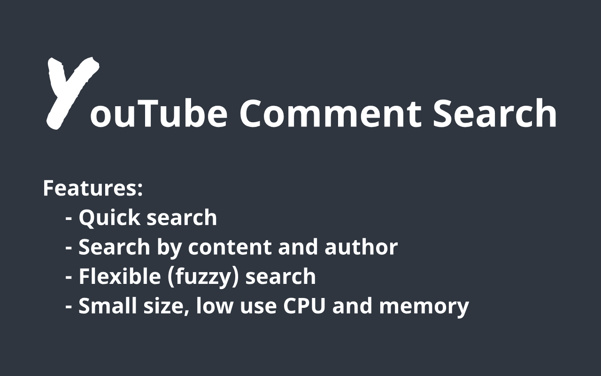

# YCS - YouTube Comment Search

Search for comments and authors in YouTube videos.

## Features
* Quick search
* Search by content and author
* Flexible (fuzzy) search
* Small size, low use CPU and memory

## Instructions
1) Click Load comments.
2) Write the search string, press Enter or Search.

## Requirements specification:
Chrome: minimum version 55

## Install
Chrome web store: [YCS](https://chrome.google.com/webstore/detail/ycs/pmfhcilikeembgbiadjiojgfgcfbcoaa)

## Privacy
[Privacy Policy](agreements/Privacy-Policy.txt)

## Author
Was created by [Eugene Gubar](https://github.com/Eugene-Gubar)

## License
This project is licensed under the MIT [License](LICENSE)