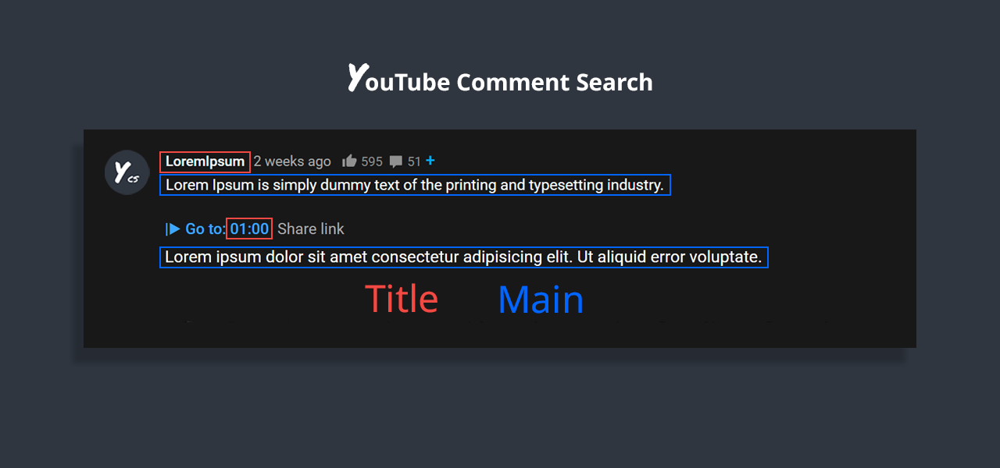

# YCS - YouTube Comment Search

### Search comments, replies, chat replay, video transcript for the current video on YouTube by contents, authors, time.
## Features
✅ Quick search by timestamp, author, content 
✅ Export comments, replies, chat replay, video transcript 
✅ Flexible (fuzzy) search 
✅ Multilingual search 
✅ Search by Emoji 
✅ Works in incognito mode 
✅ Unlimited load comments 
✅ Time stamps - show comments, replies with time stamps 
✅ Author - show comments, replies and chat comments from the author 
✅ Likes - show comments, replies by number of likes 
✅ Replied - show comments by number of replies 
✅ Members - show comments, replies and chat comments from channel members 
✅ Donated - show chat comments from users who have donated 
✅ Small size, low use CPU and memory

## Instructions

1) Open video on YouTube
2) Find the YCS extension under the current video and click the button "Load all" or choose to load the categories
3) Write the search query, press Enter or click the button Search

## Extended Search

This form of advanced searching allows you to fine-tune results.

White space acts as an **AND** operator, while a single pipe (`|`) character acts as an **OR** operator. To escape white space, use double quote ex. `="scheme language"` for exact match.

| Token       | Match type                 | Description                            |
| ----------- | -------------------------- | -------------------------------------- |
| `jscript`   | fuzzy-match                | Items that fuzzy match `jscript`       |
| `=scheme`   | exact-match                | Items that are `scheme`                |
| `'python`   | include-match              | Items that include `python`            |
| `!ruby`     | inverse-exact-match        | Items that do not include `ruby`       |
| `^java`     | prefix-exact-match         | Items that start with `java`           |
| `!^earlang` | inverse-prefix-exact-match | Items that do not start with `earlang` |
| `.js$`      | suffix-exact-match         | Items that end with `.js`              |
| `!.go$`     | inverse-suffix-exact-match | Items that do not end with `.go`       |

White space acts as an **AND** operator, while a single pipe (`|`) character acts as an **OR** operator.

## FAQ
1) **How to like, reply to a comment?** 
    In the search results, click on the date (like, "2 months ago") of the comment and will open a new window with an active comment or reply under the video, where you can do any action.

2) **How do I find all timestamped comments and replies on a video?** 
    Click on the "Time stamps" button under the search bar.

3) **How can I find addressed to user's comments, replies?** 
    Write `@` in the input field.

4) **How can I view the contents of the video transcript at a specific minute?** 
    You can write a search query for Trp. Video, in the `mm:ss` format. For example: 
    `:` - all the text of the video transcript. 
    `15:` - all the text in the 15th minute. 
And etc.

5) **How can I view the comment for a found reply?** 
    Click on the **▼** button.

6) **How can I see the all replies to the found comment?** 
    In the header of the found comment, you can find the reply icon and the count, to see the replies click on the **+** button.

## Requirements specification:
Chrome: minimum version 88

## Install
\
Install: [YCS - YouTube Comment Search](https://chrome.google.com/webstore/detail/pmfhcilikeembgbiadjiojgfgcfbcoaa)

## Permissions
youtube.com

## Privacy
[Privacy Policy](agreements/Privacy-Policy.txt)

## Author
Was created by [Eugene Gubar](https://github.com/sonigy)

## License
This project is licensed under the MIT [License](LICENSE)
